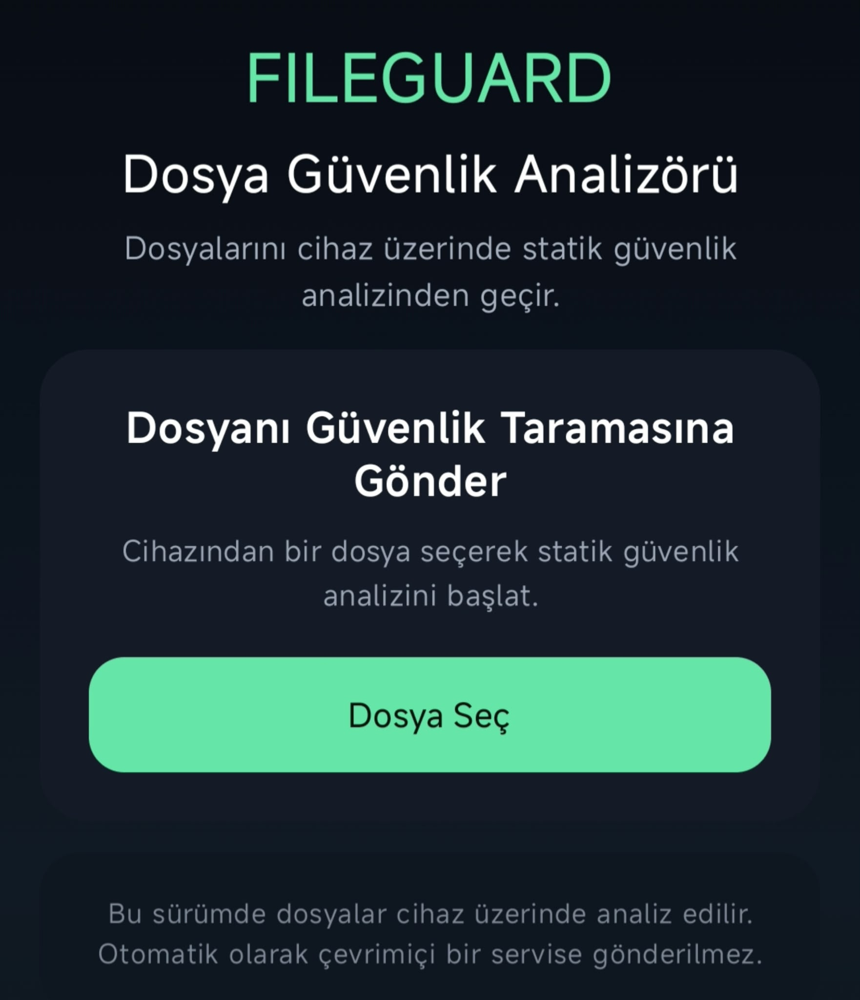
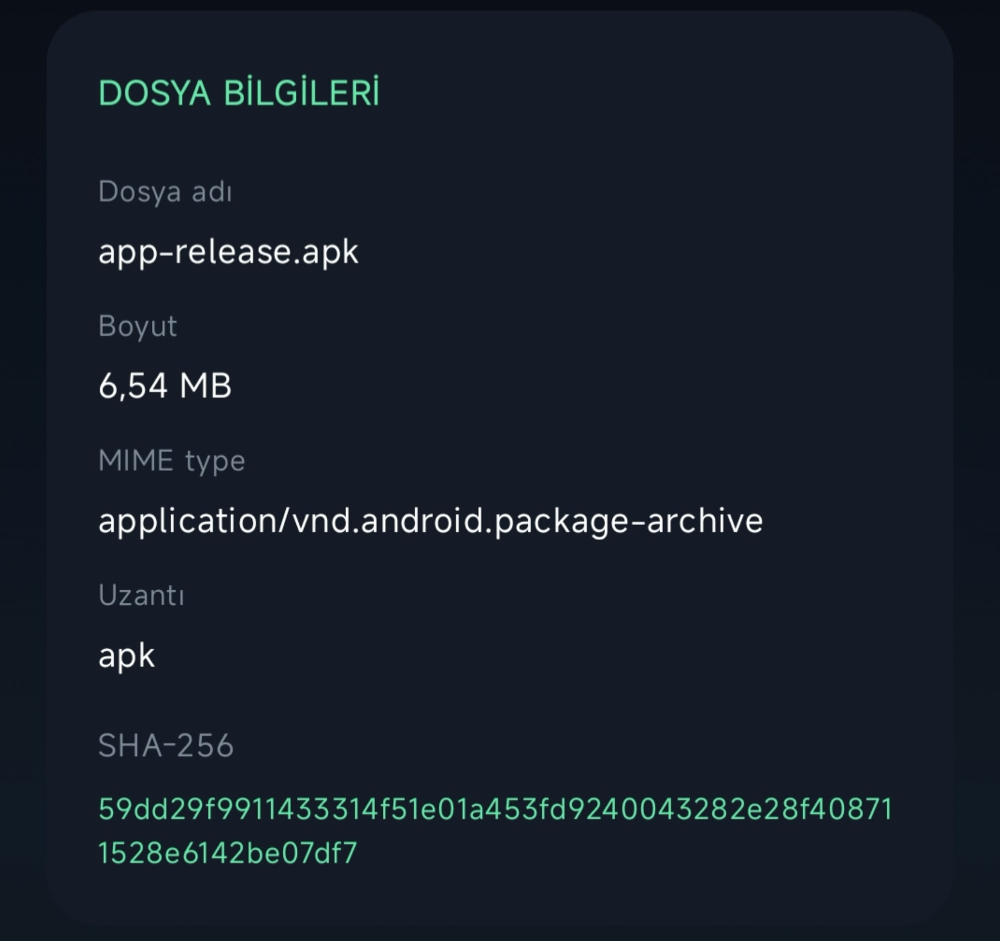
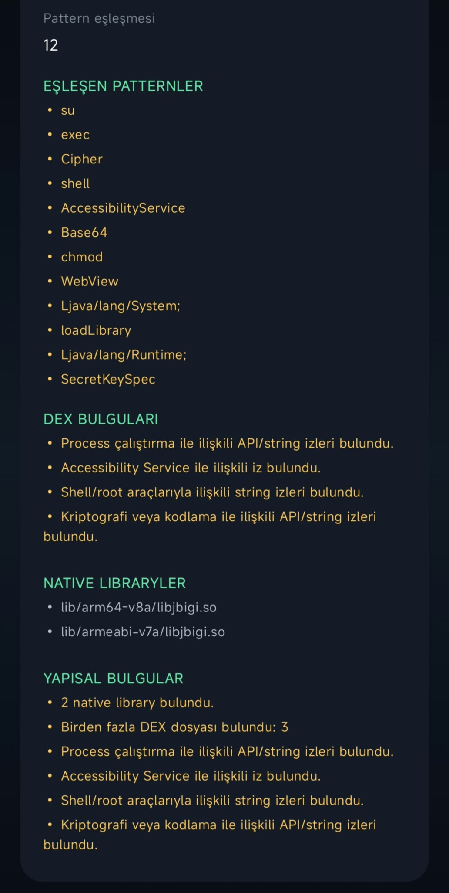
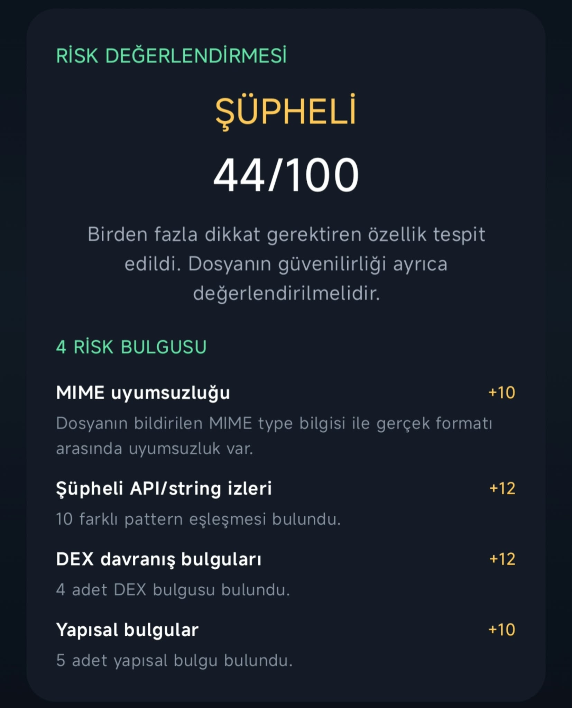

# FileGuard

**Android üzerinde çalışan statik dosya güvenlik ve risk analiz aracı**

Dosyaları çalıştırmadan analiz eder, dosya yapısını inceler, APK'ları statik olarak analiz eder ve elde edilen bulgular üzerinden bir risk değerlendirmesi oluşturur.

---

## 📸 Uygulama Görüntüleri

### Ana Ekran

  

### Dosya Analizi

  

### APK Statik Analizi

  

### Risk Değerlendirmesi

  

---

## 📱 Proje Hakkında
